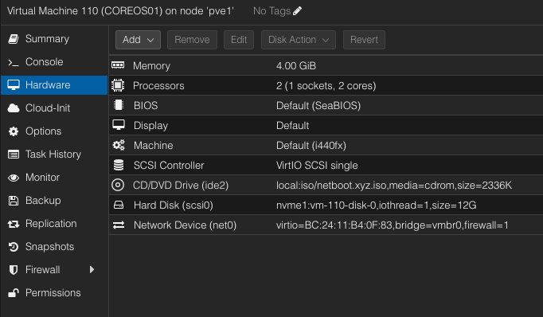
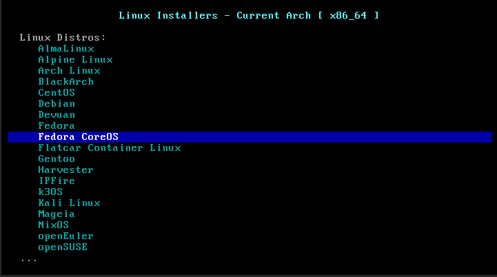
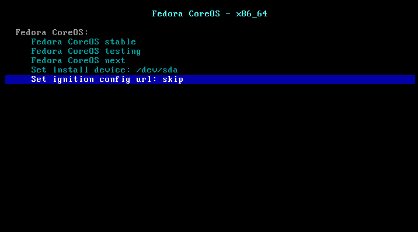
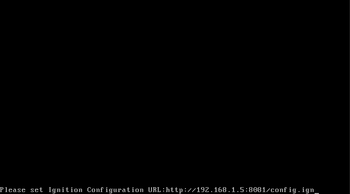
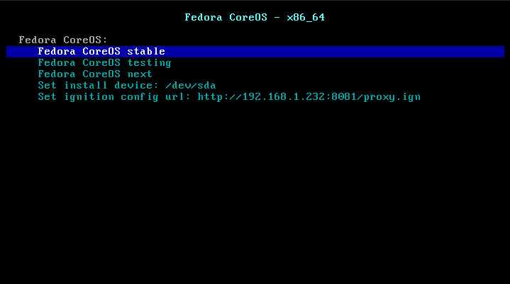
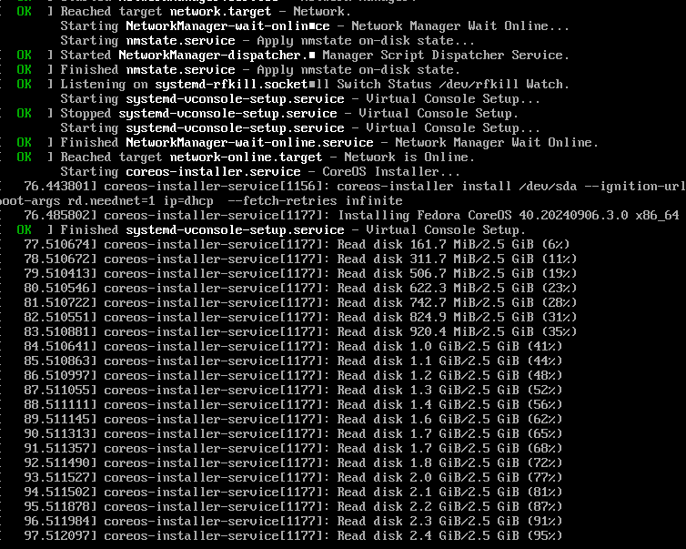
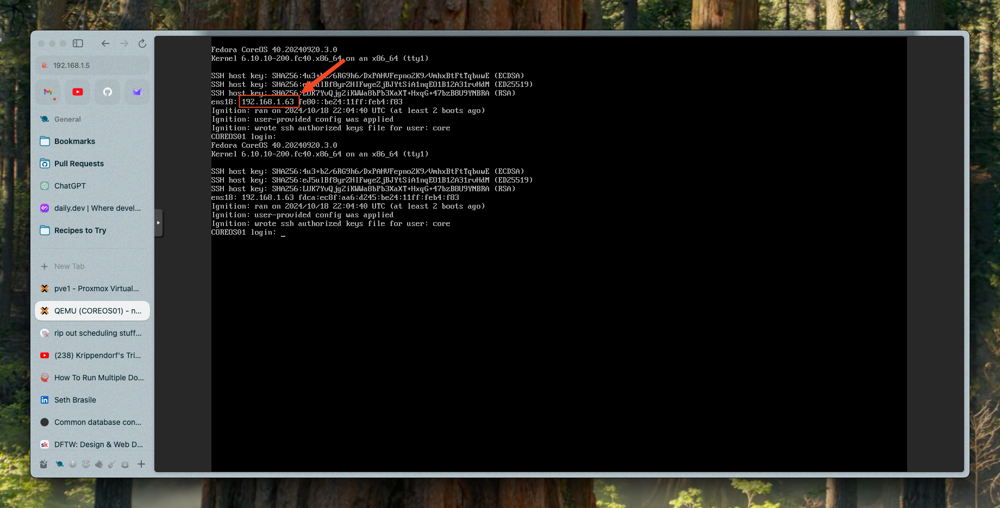

>If you missed part 1, I highly recommend reading through it first to understand the concepts and theory behind the tools we'll be using. You can [jump back to part 1 here.][part 1]

---

## Before we dive in, let's ask a couple of important questions:

- **Why are you doing this?** - Why do you want to host a web service at home?
- **Who is going to use this service?** - Is this service going to be available for the public or to friends and family? Or is this just for you?

If your motivation here is just to learn, that's great! Read on! If your motivation is to provide some private services for friends and family, that's great too!

If this is just for you, or if you're doing this for public consumption, I would suggest you reconsider, because there are better options for both of these scenarios.

## There are better options when...

### "I'm doing this for the public"
Unless your main motivation is learning, you don't want the headache of guaranteeing uptime for the public. I highly encourage you to use a cloud service in this case. Most cloud services allow you to offer anything that would be suitable for self hosting, for free, with guaranteed uptime. I highly recommend cloudflare pages/workers for static sites and vercel for dynamic. This blog is hosted on cloudflare pages.

### "I'm doing this for myself"

There are cool new concepts called SASE and ZTNA that are designed to allow you to access your services from anywhere in the world, securely, without having to expose them to the public internet. I highly recommend looking into these technologies if you're doing this just for yourself and your immediate household. It's a lot like VPN in concept, but how you interact with it, how it makes resources available, and how it decides you're OK to connect is much different. I will likely write a post on this in the future, but for now, I can just wholeheartedly recommend looking into ZTNA. Take a look at [Twingate](https://www.twingate.com/) - it's a great example. I use it in my own homelab and it has completely replaced my previous wireguard VPN setup. I run a "connector" in a container on a VM in my homelab. You can set up multiple connectors for redundancy, and it's all managed through their web interface. It took me all of 10 minutes to set up, and it's free.

(If you've heard of "cloudflare tunnel" and "tailscale" - this is basically the same thing)

The negative is that this concept starts to fall down as soon as you don't have complete control over the client devices, such as allowing your parents and siblings to access your services.

I'm willing to bet that this is the way forward and that people will eventually figure out a way to make it work for client devices that we can't perfectly control. Imagine installing a one-time-use "profile" to your mom's phone which ties to her individual login and allows her specific device to access your
services. That would be totally doable.

**With that out of the way, let's dive in!**

---

## Introduction

This is going to seem daunting at first, but I promise you, it's not that bad. Once you have this all set up, it's super easy to understand and manage. The hardest part is wrapping your head around some new concepts. I'm going to do my best to make everything as digestable as possible. Unfortunately, that means this post contains a lot of words.

# Step-by-Step Guide

## Prerequisites
- Free Cloudflare account
- Public IP address (this does not have to be static, it can be a dynamic IP)
- A VM host
  - This post is going to assume you have access to a QEMU host. I will be using proxmox. Any QEMU host should be directly applicable.
  - I would not bother if your hypervisor is HyperV. CoreOS does not play nicely with HyperV. It IS possible and I have done it, but I would not do it again. Get you a real hypervisor.
- Domain name
  - Hopefully from Cloudflare.. It _will_ make your life easier but it's not necessary. You can also transfer a domain registration to cloudflare.
  - If you bought your domain at another registrar and are keeping it there, you need to follow cloudflare's setup guides to move your DNS into cloudflare.
- Basic understanding of DNS
  - It's really not hard..
  - Watch this [fireship video](https://www.youtube.com/watch?v=UVR9lhUGAyU)
- An enterprise grade firewall (this is cheap or free, explained more in [part 3]). We **need** a few features that you're not going to find on a standard consumer router:
  - We need the ability to define an isolated network or VLAN. We don't want to haphazardly send public internet traffic into our private LAN.
  - We need the ability to pull a dynamic list of IP ranges from cloudflare and only allow connections from IPs in the list.
  - We need the ability to automatically update our DNS entries in cloudflare with our dynamic IP address.
- Up-to-date software
  - Make sure that you're running the latest versions of your application web server and the application you're hosting. We do hope that what we're accomplishing here does to some extent "protect" you when your backend services are vulnerable (explained in further detail in the section on [Known Vulnerability Attacks]), but that doesn't provide an excuse to not keep things up to date. It is absolutely mandatory to keep all of the software in your stack up to date at all times.
  - If what you're hosting is a piece of legacy software that can't be updated or replaced, _you can_ make it more secure with these techniques, but if for example there's a known vulnerability in the login page of the app that you're hosting, no amount of security is going to help you keep _that_ piece of software secure. You need to replace that software. Assuming your legacy app isn't running with root/admin privileges, you can still keep the other software on the server secure with these techniques.
  - *_it is technically possible to use a reverse proxy to inspect the contents of incoming traffic and block requests that match a known pattern, thereby writing a targeted protection for a given vulnerability, but this is a very advanced technique and it's not something that I'm going to be discussing in this post. [Here is a basic example of using this technique to block attempts at sql injection (written wayyyy back in 2013!).](https://www.yourhowto.net/nginx-block-sql-injection-and-file-injection/)_

## Let's do it!

Ok... Installing CoreOS is not your standard OS installation. At all. It's weird, but it's also really simple once you wrap your brain around it. The basic gist of how we install Fedora CoreOS is:
1. We write a YML config file that defines the operating system and services that we want running
2. We compile the config file into a format that CoreOS understands ("ignition")
3. We place the result on an internal web server (it could be external too, but the more details about our setup that we keep secret, the better)
4. We boot into the CoreOS installer
5. We tell the CoreOS installer where to find the config file
6. CoreOS installer installs CoreOS according to the config we provided
7. CoreOS boots and runs the services we defined
8. CoreOS keeps itself up to date and we don't have to think about it again unless we need to change config

### Writing the config file

I know I just went on and on about not logging in, but I'm actually going to show you how to login first, so that you can poke around, then we'll build from
there and eventually remove the option to login. This example doesn't do anything except introduce some concepts and boot and allow you to login.

First, we need to decide how we'll log in. We'll provide CoreOS with a `password_hash`. Feel free to use your public SSH key instead of a hashed password. Keep in mind though that if you disable the `password_hash` option, you won't be able to log in via the VNC console later, instead you'll need to use SSH.

In order to generate a password hash, let's use `mkpasswd` via docker:

```bash
docker run -ti --rm quay.io/coreos/mkpasswd --method=yescrypt
```

It will ask you to type a password, then it will spit out a hash that we'll use in the next step.

Now, let's create a new directory where we'll mess with this config. I'll call mine `coreos-config`. Inside this directory, create a file called `config.bu` (`bu` is short for `butane` which is the name of the human-readable standardized config format that CoreOS uses) and insert the following:

```yml
variant: fcos
version: 1.5.0

passwd:
 users:
   - name: core
     groups:
       - sudo
       - wheel
     password_hash: <!! place a password hash here... OR remove this line and use ssh key instead !!>
    #  ssh_authorized_keys:
    #    - the contents of your id_rsa.pub here
storage:
  files:
    # Set the machine hostname just so it's easier to see/find on the network in case we need that
    - path: /etc/hostname
      mode: 0644
      contents:
        inline: COREOS01
    # Console access is hard to use without this. Without this, all I/O is directed to the console
    - path: /etc/sysctl.d/20-silence-audit.conf
      mode: 0644
      contents:
        inline: |
          # hide audit messages from interactive console
          # by changing log level from DEBUG to WARNING
          kernel.printk=4
```

### Files? In this config file?

That's right, this CoreOS machine is going to be a standalone "black-box" and any files that we want to be present need to be defined in this config file.
You'll see later that we will also be defining directories here. Anything more complex probably needs to be inside of a container. I'll show you that
as well.

### Wait sec... you said "container" - Does that mean CoreOS uses Docker?

Almost... CoreOS actually uses a different containerization technology called "podman" - It's basically just Docker... But designed to be more secure
by default, and most importantly it's FREE for everyone, including enterprise.

### Preparing the config file

Before CoreOS can use this config file, we need to transpile it into a different format. I do wish this wasn't a step, it feels super unnecessary, but it
is what it is ¯\_(ツ)_/¯

We will use a cli tool via docker again. This one is called butane:

```bash
docker run -i --rm quay.io/coreos/butane:release --pretty --strict < config.bu > config.ign
```

This creates an ignition file called `config.ign` and this is the file that we'll provide to the CoreOS installer.

### Make the config file available to the CoreOS installer

The CoreOS installer expects to be run on a VM that has no resources besides network, so the standard way to provide it config is by serving it
from an HTTP server. Since you're reading this guide, I'm actually going to assume that you know how to set up an http server somewhere on your network
that is accessible to this VM. Take this config file and make it available over the network. My suggestion is to go to one of your web hosts and set up
a new nginx server in a docker container which doesn't do anything but serve this file. Here is a simple `docker-compose.yml` file that should do the trick,
just in case you're stuck here:

```yml
---
services:
  nginx:
    image: lscr.io/linuxserver/nginx:latest
    container_name: nginx-file-server
    environment:
      - PUID=1000
      - PGID=1000
      - TZ=America/Chicago
    volumes:
      - ~/files/config:/config # this assumes you have a directory on your host located at ~/files
    ports:
      - 8081:80
    restart: unless-stopped
```

_Note: For the rest of this guide, we're going to assume the nginx server we just set up is located at `192.168.1.5`, but obviously anywhere I use that IP,
you need to swap it out for your web server's IP._

Now that we have a web server set up, we're going to use SCP to copy our `config.ign` file to our new web server:

```bash
scp config.ign username@192.168.1.5:/home/username/files/config/www
```

You should now be able to download the ignition file by visiting `http://192.168.1.5:8081/config.ign`

### Installing CoreOS

Now we get to the cool part, we're going to actually install CoreOS, and we're going to do that by booting to an awesome utility called [netboot](https://netboot.xyz/).

[Go here](https://netboot.xyz/docs/booting/iso) and download the ISO and put that on your VM host. In my case, I'm using proxmox, so I can go to one of my
storage locations and select "ISO Images" -> "Download from URL" and input `https://boot.netboot.xyz/ipxe/netboot.xyz.iso`

Now I'm going to create a VM called COREOS01 with 4GB ram, 2 cpus, and 12GB of SSD disk. Feel free to provision with whatever you'd like. We will be
applying some more advanced networking configurations during [part 3] of this series. For now, I'll just say that before we actually use this as a reverse
proxy, we'll want it to be on its own isolated VLAN. While we're poking around though it doesn't matter, so feel free to configure network however you'd like.



Go ahead and boot up the machine and boot into the ISO. Netboot is really simple and intuitive. Poke around until you find the Fedora CoreOS option and select that.



Then we're going to set the ignition config URL



Which is the network path to the config file we created earlier



Then choose the release channel of your preference. I use `stable`



That's it! CoreOS installer boots up and installs CoreOS using the config we provided.



Then when installation is done, CoreOS boots up. If we provided a password hash in the config file, we can type it right into the proxmox VNC console
using user `core` (as we specified in the config file). If you provided an SSH key instead, you can close the proxmox VNC console window and connect with
ssh `ssh core@COREOS01` (depending on your network setup, you may need to open the VNC console to find the IP, or go search your router and get its IP address instead
of using the hostname)



### We're in!

Go ahead and poke around, get a feel for how you might interact with this machine if you were ever troubleshooting something. Read some guides on how file
permissions work in CoreOS. Things are very different here. Try some stuff. Use podman and run some containers.

### That was fun, but let's make something real

Now we're going to do some of those things again, except this time we can use the real config file. When you're first getting started. It's probably a good
idea to still leave yourself the ability to log in, so leave that line in where you provided a `password_hash` or ssh key. Once you're confident this is
doing what you want, then you can remove it.

In this example, I'm exposing one service to the outside world, [mealie.](https://mealie.io) I use this service to share recipes with friends and family.
I have mealie running on a VM on my network and it's exposed at port 9000. I can access this app by visiting http://my.mealie.vm.ip:9000.

<!-- _(Extra points btw if you have another isolated network segment for your web services, and use the firewall to deny traffic from it to your LAN, but allow the inverse.)_ -->

```yml
variant: fcos
version: 1.5.0
# We don't want any user capable of logging in on a production system, only provide this when debugging/developing
# https://docs.fedoraproject.org/en-US/fedora-coreos/authentication/
# Use this on your local machine (with docker installed) to generate your hashed password: docker run --rm -it ulikoehler/mkpasswd

# Temporary user to allow troubleshooting some resource/performance issues, this should generally be commented out
# passwd:
#  users:
#    - name: core
#      groups:
#        - sudo
#        - wheel
#      password_hash: ...
#      ssh_authorized_keys:
#        - ssh-rsa ...

# Here, we're defining our service which is essentially just a `docker run` command using `swag`
# All the other lines are about instructing CoreOS how and when to start and stop this service, what it's dependencies are, etc..
# You can read about these service definitions by searching for "systemd service units"
systemd:
  units:
    - name: proxy.service
      enabled: true
      contents: |
        [Unit]
        Description=Reverse proxy to internal web servers
        After=network-online.target
        Wants=network-online.target
        RequiresMountsFor=/tmp/podman-run-1000/containers /var/home/core/appdata/proxy

        [Service]
        Type=simple
        Environment=PODMAN_SYSTEMD_UNIT=%n
        Restart=on-failure
        User=core
        Group=core
        ExecStartPre=podman pull lscr.io/linuxserver/swag

        ExecStart=podman run --name proxy -p 443:443 -p 80:80 -v /var/home/core/appdata/proxy:/config:z \
          -e TZ=America/Chicago -e SUBDOMAINS=wildcard -e URL=yourdomain.com -e VALIDATION=dns \
          -e DNSPLUGIN=cloudflare -e EMAIL=youremail@example.com -e CERTPROVIDER=zerossl -e STAGING=false \
          lscr.io/linuxserver/swag

        ExecStop=podman stop proxy
        ExecStopPost=podman rm -f proxy
        KillMode=none
        TimeoutSec=300
        TimeoutStopSec=70

        [Install]
        WantedBy=multi-user.target default.target
# Since CoreOS defaults to very restrictive and podman is rootless, we need to explicitly define some directories and set permissions.
storage:
  directories:
    # The rest of these directories are just to specify permissions
    - path: /var/home/core/appdata/proxy
      mode: 0755
      user:
        name: core
      group:
        name: core
    - path: /var/home/core/appdata/proxy/nginx
      mode: 0755
      user:
        name: core
      group:
        name: core
    - path: /var/home/core/appdata/proxy/dns-conf
      mode: 0644
      user:
        name: core
      group:
        name: core
    - path: /var/home/core/appdata/proxy/nginx/proxy-confs
      mode: 0644
      user:
        name: core
      group:
        name: core
  files:
    # Set the machine hostname
    - path: /etc/hostname
      mode: 0644
      contents:
        inline: COREOS01

    # Without this, all I/O is directed to the console so console access becomes tough
    - path: /etc/sysctl.d/20-silence-audit.conf
      mode: 0644
      contents:
        inline: |
          # hide audit messages from interactive console
          # by changing log level from DEBUG to WARNING
          kernel.printk=4

    # Allow podman to use port 80 without root. I need this so I can expose this machine at the edge but also still access these services
    # locally. I use local DNS to point my own domain to this proxy so that https works internally and I'm able to skip the internet.
    # If your situation doesn't require this, you can remove this and adjust the `swag` container to expose a different port.
    - path: /etc/sysctl.d/100-sysctl.conf
      mode: 0644
      contents:
        inline: net.ipv4.ip_unprivileged_port_start=80

    # Set a "mildly cautious" update strategy (0.5 is middle of the road, 1 is most cautious) that will
    # only take place during a defined maintenance window
    - path: /etc/zincati/config.d/51-rollout-wariness.toml
      mode: 0600
      contents:
        inline: |
          [identity]
          rollout_wariness = 0.5

          [updates]
          strategy="periodic"

          [updates.periodic]
          time_zone = "America/Chicago"

          [[updates.periodic.window]]
          start_time = "04:30"
          length_minutes = 240

    # Allow letsencrypt to use your cloudflare account via API token. Letsencrypt needs to access your
    # cloudflare account in order to create DNS records that allow automated proof of domain name ownership.
    # Letsencrypt does offer different methods, but this seems most foolproof.
    - path: /var/home/core/appdata/proxy/dns-conf/cloudflare.ini
      mode: 0600
      user:
        name: core
      group:
        name: core
      contents:
        inline: |
          # With global api key (comment line below and uncomment these lines to use):
          #dns_cloudflare_email = youremail@example.com
          #dns_cloudflare_api_key = 0123456789abcdef0123456789abcdef01234567

          # With api token
          dns_cloudflare_api_token = ... you cloudflare api token ...

    # We want any connection negotiated through this proxy to use HTTPS
    - path: /var/home/core/appdata/proxy/nginx/proxy-confs/https-redirect.conf
      mode: 0644
      user:
        name: core
      group:
        name: core
      contents:
        inline: |
          # Redirect all sites http to https
          server {
            listen 80 default_server;
            listen [::]:80 default_server;
            server_name _;
            return 301 https://$host$request_uri;
          }

    # ------- ******************* Here is where we define the proxied sites ******************* ------- #
    #
    # Get these these swag nginx configurations from https://github.com/linuxserver/reverse-proxy-confs
    #
    # When I set up a new service and decide I'd like to access it from my domain name, I check here first
    # because they have usually already written a config file for it. Copy and paste the contents of the
    # config file and adjust values to match your own environment. You can ignore the message at the top
    # of each file telling you to ensure you DNS has a CNAME set. You may very well need a CNAME, but that
    # message isn't directly applicable to this situation. Keep in mind that this act does not in itself
    # make your service available to the outside world, these configs are valuable for internal services too.
    #
    # ------- ********************************************************************************** ------- #

    #  Each -Path entry defines a new file, and each file corresponds to a proxied URL
    - path: /var/home/core/appdata/proxy/nginx/proxy-confs/mealie.subdomain.conf
      mode: 0644
      user:
        name: core
      group:
        name: core
      contents:
        inline: |
          ## Version 2023/05/31
          # Ensure your DNS has a CNAME set for mealie and that mealie container is named.

          server {
              listen 443 ssl http2;
              listen [::]:443 ssl http2;

              server_name mealie.sethbrasile.com;

              include /config/nginx/ssl.conf;

              client_max_body_size 0;

              # enable for ldap auth (requires ldap-location.conf in the location block)
              #include /config/nginx/ldap-server.conf;

              # enable for Authelia (requires authelia-location.conf in the location block)
              #include /config/nginx/authelia-server.conf;

              # enable for Authentik (requires authentik-location.conf in the location block)
              #include /config/nginx/authentik-server.conf;

              location / {
                  # enable the next two lines for http auth
                  #auth_basic "Restricted";
                  #auth_basic_user_file /config/nginx/.htpasswd;

                  # enable for ldap auth (requires ldap-server.conf in the server block)
                  #include /config/nginx/ldap-location.conf;

                  # enable for Authelia (requires authelia-server.conf in the server block)
                  #include /config/nginx/authelia-location.conf;

                  # enable for Authentik (requires authentik-server.conf in the server block)
                  #include /config/nginx/authentik-location.conf;

                  include /config/nginx/proxy.conf;
                  include /config/nginx/resolver.conf;
                  set $upstream_app <your.host.ip>;
                  set $upstream_port 9000;
                  set $upstream_proto http;
                  proxy_pass $upstream_proto://$upstream_app:$upstream_port;
              }
          }

```

## Conclusion

The integration of reverse proxies with Fail2Ban, all running in containers hosted on Fedora CoreOS, creates a formidable defense strategy for web services.
This configuration leverages the strengths of each component—reverse proxies for traffic management and encryption, Fail2Ban for automated threat mitigation,
and Fedora CoreOS containers for secure, scalable, and isolated environments. By adopting this approach, organizations can significantly enhance the security, reliability, and performance of their web services, staying one step ahead in the ongoing battle against cyber threats.


---

## Bonus!

--> Head to [part 3] to learn how to set up an enterprise-grade firewall with pfSense.

[part 1]: /posts/protect-your-services-with-an-immutable-reverse-proxy-fail2ban-and-cloudflare-part-1/
<!-- [part 3]: /posts/protect-your-services-with-an-immutable-reverse-proxy-fail2ban-and-cloudflare-part-3/ -->
[part 3]: /coming-soon
[Known Vulnerability Attacks]: /posts/protect-your-services-with-an-immutable-reverse-proxy-fail2ban-and-cloudflare-part-1/#known-vulnerability-attacks
