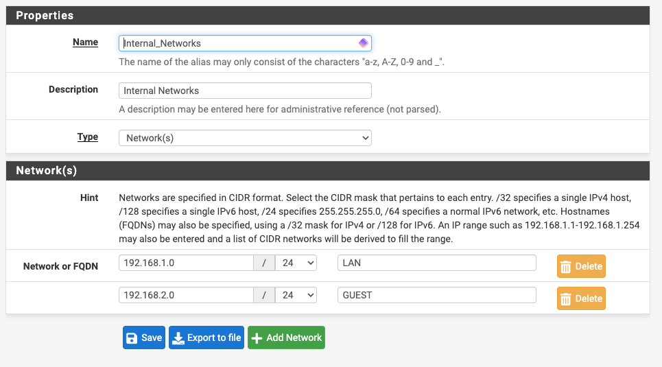
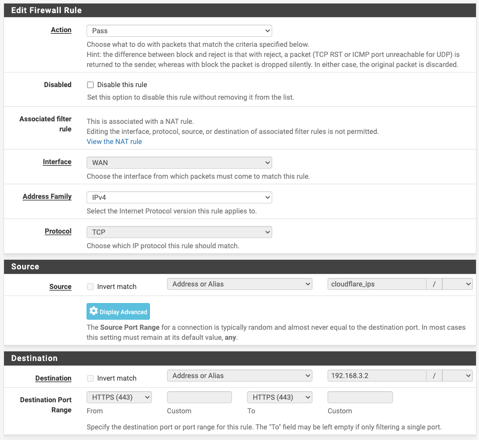

*If you missed part 1, I highly recommend reading through it first to understand the concepts and theory behind the tools we'll be using, and this part doesn't make a lot of sense without part 2. Jump back to [part 1] or [part 2].*

---

# Configuring your Firewall to safely point traffic to your services through a reverse proxy

In the last post, we completed configuring a fully functional CoreOS reverse proxy in a VM, but we didn't finish configuring network, so it doesn't do
much for us yet.

We're going to start this post by discussing goals, then we're going to move to a practical application using pfSense as an example. Any Enterprise
grade firewall is going to have basically the same features. They might use different terminology, but they all do the same things. If you're not using
pfSense, you may need to search around for something like "Setting up VLAN on firewall {insert firewall brand}"

## Goals

Our goal now is to configure the network on our VM and on our firewall to isolate this proxy on its own physical network or _more likely_ on its own VLAN.
The main goal here is that from the perspective of the reverse proxy, your internal network should be completely inaccessible except for the explicit
paths that you allow for your services to function. Think "Principle of Least Privilege."

For example, in the Mealie example from the previous post. I don't want my proxy machine capable of communicating to any other machine anywhere on
my network, and I don't want it talking to the machine hosting mealie on any other port than `9000`. I also don't want it communicating via any
other protocol than HTTP. My CoreOS machine should not be capable of creating an SSH connection to the machine hosting my service. If a debian exploit
were to pop up suddenly which somehow allows unrestricted access to a certain type of traffic to some random port, I want odds to be in my favor, that
it's not port `9000`. I want to enforce this all at the network so that if I were to momentarily drop the machine firewall on a machine on my network, and somehow my reverse proxy had a "bad actor" who had taken up residence, they can't gain any additional foothold in my network because I have sane
networking rules in place.

## Quick note on physical networks

We're going to be using VLANs to create network segmentation here, but separate physical networks and layer 2 routing are a great option too and they provide
even more calm safe feelings (though I don't believe they're _actually_ safer than VLANs ... I'm not a network or network security expert though..). If you have the ability to put your proxy and your backing services on separate physical networks, have at it, that sounds great. The same general concepts apply,
you just won't need to do the VLAN tagging portion. We're going to assume VLANs for the rest of this guide.

## Implementation

Here's a bullet point list of what we'll be accomplishing:

- At the firewall:
  - [Create a VLAN](#create-vlan) called `UNTRUSTED`
  - [Create a subnet](#create-a-subnet) (`192.168.3.0/30`)
  - [Create a DHCP scope](#create-a-dhcp-scope) (`192.168.3.2 - 192.168.3.2`)
  - [Create a DHCP reservation](#create-a-dhcp-reservation) for the CoreOS VM (you could alternatively leave DHCP off and use a static IP
    configured in CoreOS config instead)
- Our host is plugged into a switch, so we will [inform our switch](#inform-our-switch) about the VLAN (you can skip this if your host plugs directly
  into your firewall)
- [Tag the CoreOS VM's network adapter](#tag-the-network-adapter) for the VLAN ID we defined, this effectively "places" this machine on the VLAN
- [Create an alias](#create-an-alias) that pulls cloudflare's list of IPs
- [Create some firewall rules](#create-some-firewall-rules):
  - Create an `Internal_Networks` alias that includes GUEST and LAN networks (or any internal networks you may have)
  - Create a firewall rule originating from `UNTRUSTED` that allows all traffic except denies traffic to destination `Internal_Networks`
  - Create a firewall rulle originating from `UNTRUSTED` that allows TCP traffic from CoreOS VM to internal service
- [Forward incoming traffic](#forward-incoming-traffic) through NAT to the reverse proxy

### Create VLAN

In my case, I'm creating VLAN 3 on the LAN parent interface

Then I assign it an interface

I'm naming it `UNTRUSTED` so that no matter where we see the name, it's always very clear what network this is. I'm looking at this network almost like
the concept of a "DMZ" except that we're actually very careful about this zone, so it wouldn't be correct to call it "demilitarized."

### Create a subnet

In `Interfaces` -> `UNTRUSTED`, enable the interface and create a static IP and corresponding subnet for the firewall. I recommend making the subnet a
`/30` ([details on /30](https://www.calculator.net/ip-subnet-calculator.html?cclass=any&csubnet=30&cip=192.168.3.0&ctype=ipv4&x=Calculate)) because I only want the firewall and the CoreOS machine to reside on this subnet. If you want to place more machines in this `UNTRUSTED` zone, feel
free to slice it differently.

### Create a DHCP scope

I'm using DHCP because that's one less thing that needs to go into my CoreOS config and because I like DHCP. Feel free to go without if you'd like.

I also use DHCP to hand CoreOS the cloudflare DNS servers. I use a private DNS setup (pihole) for the rest of my network, but in the interest of keeping
things isolated, and because this machine doesn't really need to know about my private network details, I use public DNS here.

### Create a DHCP reservation

**Just kidding!**

We don't need to create a DHCP reservation because there's only one possible IP on this network. Keep in mind that if you were to completely
remove the VM and create a new one with a new MAC address, you'd likely end up "out of IP addresses" until the previous lease runs out. If you ever do that,
you'll likely need to pop into the firewall and remove the previous DHCP lease before your firewall will consider the one IP available again.

### Inform our switch

If our VM host is plugged into a switch, that switch needs to be capable of "speaking vlan" and it's likely that we need to log into our switch's
management software and "tag" the port that our VM host is plugged into with our VLAN ID. Otherwise, it will be unwilling to pass this traffic along.
In my case, my switch is a unifi switch, so I'm following their documentation on "tagging" a port for a VLAN. It doesn't make sense for me to generalize
this step past this, go look up the docs for your switch.

### Tag the network adapter

In proxmox (so therefore QEMU) we can tag the VM's network traffic right on the adapter. I can't speak for all hypervisors. Again, look up the specific
documentation for your hypervisor to find out how to tag your VM's traffic with the VLAN that you created. Here's how it looks in proxmox:

### Create an alias

We need to pull Cloudflare's list of IPs because we're going to whitelist them and block connections from anywhere else. This forces web traffic to
enter via URL, only through Cloudflare, that way random scanners out there scanning the whole internet won't find anything useful at our IP. If you're
not using pfSense, you need to check docs or search for something like "whitelist CIDR block {insert firewall brand}"

In the case of pfSense, go to `Firewall` -> `Aliases` -> `URLs` and create the following:

### Create some firewall rules

**We're almost done!!**

Now we need to let our firewall know what should be allowed to talk to what.

The CoreOS machine can go ahead and have access to the whole internet for all I care, so it can basically talk to whatever it wants, BUT, I don't want it
to access anything on my internal networks. The way we accomplish this in pfSense is by creating another alias. I call mine `Internal_Networks`, and in
it, I list out my `LAN` network and my `GUEST` network.

Then I head over to firewall rules and create a new firewall rule on the `UNTRUSTED` interface that looks like this:

This rule says "As long as it's NOT destined for an address listed in `Internal_Networks`, allow any traffic that originates from `192.168.3.2` to pass"

THEN we're going to create a rule that supersedes this rule. In the case of pfSense, that means I need the next rule to go ABOVE the previous one in the
list because they're evaluated in order from the top to the bottom.

I want this one to say, "If traffic originates from `192.168.3.2` and is destined for my backend service IP, allow it to pass"

It is a great idea to even allow this by specific port. I used to have mine like that, but I felt that it got cumbersome. I use a specific VM to host ONLY
these types of services, so in my case, it feels safe to allow all ports through, as long as it's TCP coming from my proxy. I encourage you to be safer than
me and list out rules for each port for each service.

### Forward incoming traffic

This is the last step!! (well... you may still have work to do in setting up your domain at cloudflare, setting up dynamic DNS, etc..)

Now we're going to allow traffic from Cloudflare to pass through our firewall, traverse NAT, and end up at our reverse proxy! I have opted to allow
both port 80 and port 443 through the firewall, but as you saw in the previous post, if any port 80 traffic makes it in, it is immediately redirected to
port 443 in nginx. There are many valid ways to achieve this. You could not allow it through and instead use Cloudflare to force all traffic to HTTPS
before it gets to you, for instance.

I created two identical port forwards that look like this

By creating them like this:

In the case of pfSense, that "Add associated filter rule" option automatically creates firewall rules that look like this.

Using 443 as an example, the result here is a rule that says "As long as Inbound traffic on port 443 came from a Cloudflare IP, forward it through NAT to the reverse proxy. Otherwise, deny."

### We're done!

You should now be able to point a domain from cloudflare (ORANGE cloud, as in "Cloudflare Proxy Enabled") to your external IP address. As long as the domain
you pointed matches a domain configured in your CoreOS config, your firewall should pass traffic through to your proxy, and your proxy should pass traffic
through to your backend service! All without exposing your public IP to the outside world!

If anything is acting unexpectedly, go ahead and log back into the CoreOS box and troubleshoot. Is the traffic hitting CoreOS? Is the traffic hitting your
firewall?

Once you're confident that things are working as they should, you can go ahead and remove that pesky user by commenting out that `passwd` section of your
CoreOS config file. You should also go back and make sure `STAGING` is set to `false` in your `swag` config.

## What's next?

In the next installment, we'll be walking through building a firewall and configuring pfSense and we'll be using pfSense to dynamically update
cloudflare with our dynamic IP address. We will also be configuring internal DNS to **skip the internet** for local traffic, this way you can use the same
domain name internally and traffic will only traverse your internal network.

If you've made it this far, I'd bet you can figure out how to handle at least the dynamic IP part right now, on your own 😉

_Hint: Some firewalls can talk directly to the Cloudflare API to update the IP in your DNS entries_ 😬

[part 1]: /posts/protect-your-services-with-an-immutable-reverse-proxy-fail2ban-and-cloudflare-part-1/
[part 2]: /posts/protect-your-services-with-an-immutable-reverse-proxy-fail2ban-and-cloudflare-part-2/
